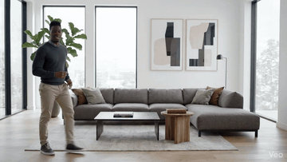
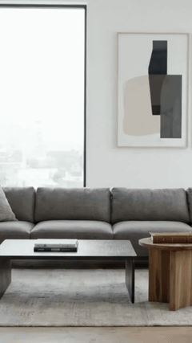

# Verthor

Scene-aware vertical auto-reframe CLI that turns horizontal footage into 9:16 video without losing the subject.


## Highlights

- Tracks people, pets, and vehicles through scene cuts with YOLOv11 segmentation and ByteTrack.
- Face-, pose-, and saliency-aware framing with a subject ranking model and smoothed camera path.
- Four tuned presets (`talking_head`, `sports`, `pets`, `cars`) with sensible zoom and motion limits.
- Fast `handcrafted` saliency by default, with optional slow/experimental `deepgazemr` model saliency.
- One-click macOS launcher (`run_verthor.command`) with native dialogs for video, preset, saliency mode, and debug preview.

## Demo

| Source (16:9) | Verthor output (9:16) |
| :---: | :---: |
|  |  |

Full-quality files: [assets/demo_source.mp4](assets/demo_source.mp4), [assets/demo_vertical.mp4](assets/demo_vertical.mp4).

## Overview

Vertical platforms (Reels, Shorts, TikTok) demand 9:16 video, but most source material is shot horizontally. Verthor reads a video, detects subjects per scene, ranks candidate subjects using model signals, and drives a virtual camera (pan + zoom) through a smoothed path optimizer. It emits a ready-to-publish MP4 via ffmpeg.

## Motivation

Naive center-cropping loses the subject the moment they move. Manual reframing is tedious for long footage. Verthor combines segmentation, face/pose cues, saliency, tracking continuity, and scene detection so each shot gets its own framing decision without relying on a static center crop.

## Features

- Per-scene subject selection via PySceneDetect (`AdaptiveDetector`).
- YOLOv11 instance segmentation with configurable classes and confidence.
- MediaPipe face detection and pose landmarks for framing cues.
- Two-person framing mode when a second subject crosses a spatial threshold.
- `handcrafted` saliency mode by default: fast and usually best for simple single-subject videos.
- Optional `deepgazemr` saliency mode: slower, experimental, useful to try on complex or ambiguous scenes.
- Automatic fallback from `deepgazemr` to `handcrafted` if model loading or inference fails.
- Saliency telemetry in logs and final summary: requested backend, active backend, model loaded state, fallback frames, and device.
- Subject lock, min/max zoom, max step-per-frame, and per-axis motion damping.
- Post-processing via ffmpeg: configurable encoder, CRF, audio bitrate, and optional unsharp/denoise pass.
- Debug preview export for inspecting crop decisions frame-by-frame.

## Architecture

```
input video
    │
    ▼
PySceneDetect ──── per-scene boundaries
    │
    ▼
YOLOv11-seg + ByteTrack ──── candidates (bbox, mask, track id)
    │
    ▼
MediaPipe face/pose + saliency ──── model signals
    │
    ▼
Subject ranking model ──── selected subject / focus bounds
    │
    ▼
Camera observation + path optimizer ──── smoothed pan/zoom
    │
    ▼
Cropped 1080×1920 frames → ffmpeg encode
    │
    ▼
output MP4
```

Core logic lives in `src/verthor/auto_reframe.py` as a single pipeline with `Candidate`, `CameraObservation`, and `CameraState` dataclasses.

## Tech Stack

- **Language:** Python 3.11+
- **Detection & tracking:** Ultralytics YOLOv11, ByteTrack (`lap`)
- **Pose & face:** MediaPipe 0.10
- **Scene detection:** PySceneDetect
- **ML runtime:** PyTorch 2.2+
- **Encoding:** ffmpeg (external)

## Quick Start

Prerequisites: Python 3.11+ and `ffmpeg` in `PATH` (`brew install ffmpeg` on macOS).

```bash
git clone https://github.com/KazKozDev/auto-vertical-reframe.git
cd auto-vertical-reframe
python3 -m venv .venv && source .venv/bin/activate
pip install -U pip
pip install -e .

verthor input.mp4 output_vertical.mp4 --preset talking_head
```

By default Verthor uses the fast `handcrafted` saliency backend.

On macOS you can instead double-click `run_verthor.command` — it provisions the venv and prompts for input, preset, debug preview, and saliency mode via native dialogs. If a non-video file is accidentally passed to the launcher, it opens the file picker again instead of trying to process it.

## Usage

Interview / talking head, default 1080×1920:
```bash
verthor clip.mp4 clip_vertical.mp4 --preset talking_head
```

Explicit fast saliency mode:
```bash
verthor clip.mp4 clip_vertical.mp4 --saliency-model handcrafted
```

Slow experimental DeepGaze MR saliency mode:
```bash
verthor clip.mp4 clip_vertical.mp4 --saliency-model deepgazemr
```

Sports footage with wider framing and debug preview:
```bash
verthor match.mp4 match_vertical.mp4 --preset sports --save-debug-preview
```

See `verthor --help` for the full flag list (saliency backend/device, motion damping, zoom bounds, ffmpeg encoder, etc.).

## Project Structure

```
verthor/
├── src/verthor/
│   ├── auto_reframe.py   # full pipeline: detection, tracking, framing, encode
│   └── __main__.py       # `python -m verthor` entry
├── assets/               # demo clips used in the README
├── run_verthor.command   # macOS double-click launcher
├── yolo11n-seg.pt        # default segmentation weights
├── pyproject.toml
└── requirements.txt
```

## Status

Beta. API and CLI flags may change between versions.

## Testing

Testing is planned for future releases.

## Contributing

See [CONTRIBUTING.md](CONTRIBUTING.md) for guidelines.

---

MIT — see [LICENSE](LICENSE)

KazKozDev — [kazkozdev@gmail.com](mailto:kazkozdev@gmail.com)
